# [📈 Live Status](https://demo.upptime.js.org): <!--live status--> **🟧 Partial outage**

This repository contains the open-source uptime monitor and status page for [MatiasM87](https://demo.upptime.js.org), powered by [Upptime](https://github.com/upptime/upptime).

With [Upptime](https://upptime.js.org), you can get your own unlimited and free uptime monitor and status page, powered entirely by a GitHub repository. We use [Issues](https://github.com/MatiasM87/MatiasM87/issues) as incident reports, [Actions](https://github.com/MatiasM87/MatiasM87/actions) as uptime monitors, and [Pages](https://demo.upptime.js.org) for the status page.

<!--start: status pages-->
<!-- This summary is generated by Upptime (https://github.com/upptime/upptime) -->
<!-- Do not edit this manually, your changes will be overwritten -->
<!-- prettier-ignore -->
| URL | Status | History | Response Time | Uptime |
| --- | ------ | ------- | ------------- | ------ |
|  [Greenpeace App](https://app.greenpeace.org.ar/coupon/regular/forms/registration) | 🟩 Up | [greenpeace-app.yml](https://github.com/MatiasM87/uptime/commits/HEAD/history/greenpeace-app.yml) | 

 210ms
     
 | 

<a href="https://MatiasM87.github.io/uptime/history/greenpeace-app">99.15%</a>
    

|  [Ticketing App](https://rt.greenpeace.org.ar/) | 🟥 Down | [ticketing-app.yml](https://github.com/MatiasM87/uptime/commits/HEAD/history/ticketing-app.yml) | 

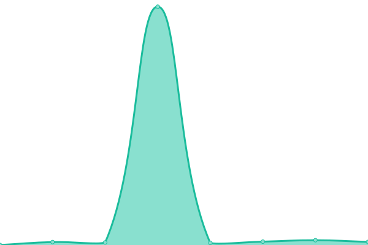 508ms
     
 | 

<a href="https://MatiasM87.github.io/uptime/history/ticketing-app">52.73%</a>
    

|  [Inventario App](https://inventario.voluntariosgreenpeace.cl/) | 🟥 Down | [inventario-app.yml](https://github.com/MatiasM87/uptime/commits/HEAD/history/inventario-app.yml) | 

 533ms
     
 | 

<a href="https://MatiasM87.github.io/uptime/history/inventario-app">53.06%</a>
    

|  [BackOffice App [AR]](https://backoffice.greenpeace.org.ar/) | 🟩 Up | [back-office-app-ar.yml](https://github.com/MatiasM87/uptime/commits/HEAD/history/back-office-app-ar.yml) | 

 227ms
     
 | 

<a href="https://MatiasM87.github.io/uptime/history/back-office-app-ar">100.00%</a>
    

|  [BackOffice App [CL]](https://backoffice.voluntariosgreenpeace.cl/) | 🟩 Up | [back-office-app-cl.yml](https://github.com/MatiasM87/uptime/commits/HEAD/history/back-office-app-cl.yml) | 

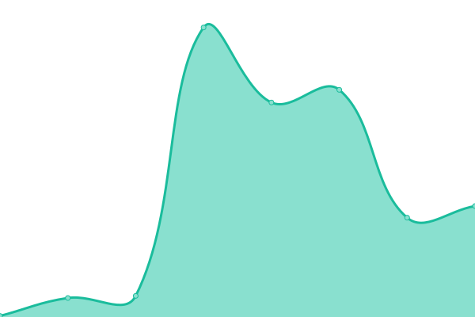 171ms
     
 | 

<a href="https://MatiasM87.github.io/uptime/history/back-office-app-cl">92.72%</a>
    

|  [BackOffice Info Greenpeace](https://backoffice.infogreenpeace.org/) | 🟩 Up | [back-office-info-greenpeace.yml](https://github.com/MatiasM87/uptime/commits/HEAD/history/back-office-info-greenpeace.yml) | 

 167ms
     
 | 

<a href="https://MatiasM87.github.io/uptime/history/back-office-info-greenpeace">100.00%</a>
    

|  [Bajemos Los Bronces](https://bajemoslosbronces.cl/) | 🟩 Up | [bajemos-los-bronces.yml](https://github.com/MatiasM87/uptime/commits/HEAD/history/bajemos-los-bronces.yml) | 

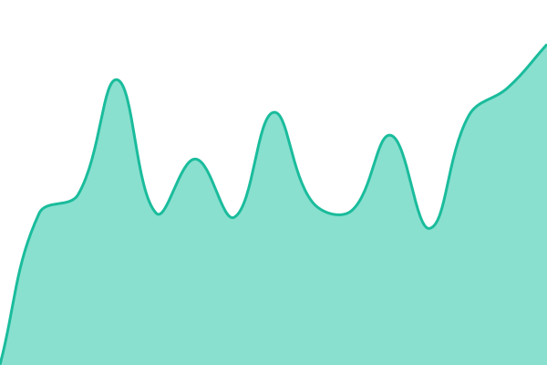 714ms
     
 | 

<a href="https://MatiasM87.github.io/uptime/history/bajemos-los-bronces">100.00%</a>
    

|  [Salva las Leyes Ambientales](https://salvalasleyesambientales.org/) | 🟩 Up | [salva-las-leyes-ambientales.yml](https://github.com/MatiasM87/uptime/commits/HEAD/history/salva-las-leyes-ambientales.yml) | 

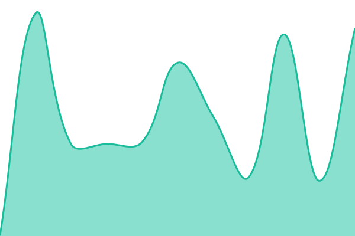 261ms
     
 | 

<a href="https://MatiasM87.github.io/uptime/history/salva-las-leyes-ambientales">100.00%</a>
    

|  [Builder Greenpeace AR](https://builder.greenpeace.org.ar/) | 🟩 Up | [builder-greenpeace-ar.yml](https://github.com/MatiasM87/uptime/commits/HEAD/history/builder-greenpeace-ar.yml) | 

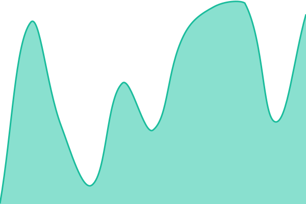 172ms
     
 | 

<a href="https://MatiasM87.github.io/uptime/history/builder-greenpeace-ar">100.00%</a>
    

|  [Greenpeace en las Escuelas](https://greenpeaceenlasescuelas.org/) | 🟩 Up | [greenpeace-en-las-escuelas.yml](https://github.com/MatiasM87/uptime/commits/HEAD/history/greenpeace-en-las-escuelas.yml) | 

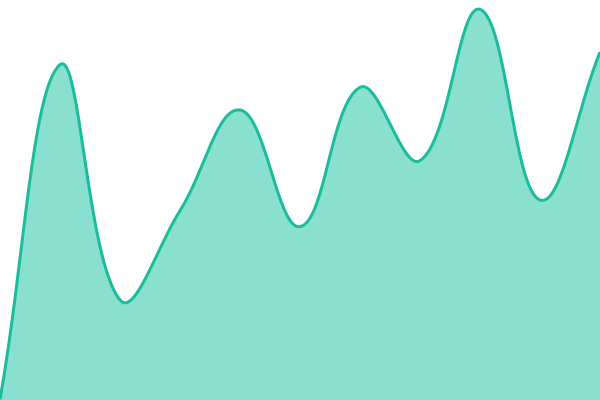 289ms
     
 | 

<a href="https://MatiasM87.github.io/uptime/history/greenpeace-en-las-escuelas">100.00%</a>
    

|  [Middleware Consultas](https://middleware-consultas.infogreenpeace.org/) | 🟩 Up | [middleware-consultas.yml](https://github.com/MatiasM87/uptime/commits/HEAD/history/middleware-consultas.yml) | 

 133ms
     
 | 

<a href="https://MatiasM87.github.io/uptime/history/middleware-consultas">100.00%</a>
    

|  [Middleware Consultas Login](https://middleware-consultas.infogreenpeace.org/login) | 🟩 Up | [middleware-consultas-login.yml](https://github.com/MatiasM87/uptime/commits/HEAD/history/middleware-consultas-login.yml) | 

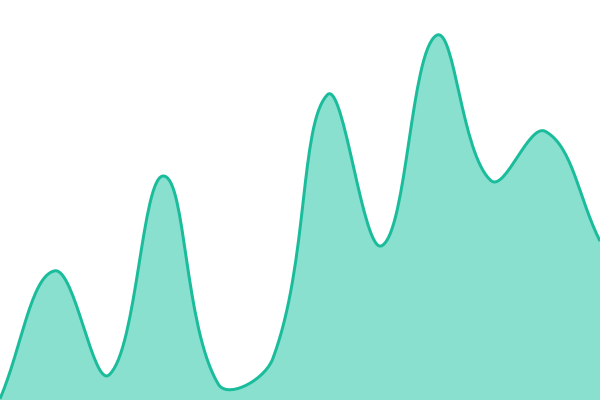 131ms
     
 | 

<a href="https://MatiasM87.github.io/uptime/history/middleware-consultas-login">100.00%</a>
    

|  [Monitor Info Greenpeace](https://monitor.infogreenpeace.org/) | 🟩 Up | [monitor-info-greenpeace.yml](https://github.com/MatiasM87/uptime/commits/HEAD/history/monitor-info-greenpeace.yml) | 

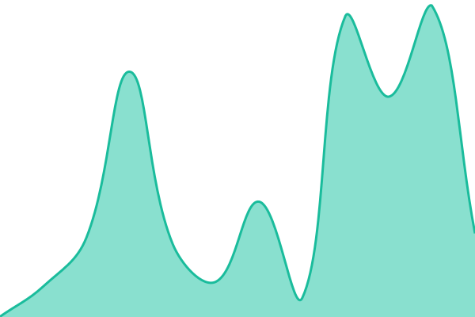 195ms
     
 | 

<a href="https://MatiasM87.github.io/uptime/history/monitor-info-greenpeace">76.11%</a>
    

|  [Hub Data Info Greenpeace](https://hub.data.infogreenpeace.org/browser) | 🟩 Up | [hub-data-info-greenpeace.yml](https://github.com/MatiasM87/uptime/commits/HEAD/history/hub-data-info-greenpeace.yml) | 

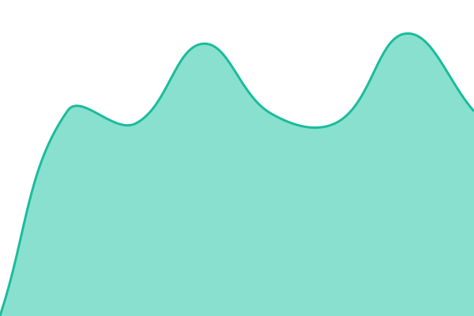 1265ms
     
 | 

<a href="https://MatiasM87.github.io/uptime/history/hub-data-info-greenpeace">100.00%</a>
    

|  [Dev Upgrade Info Greenpeace](https://dev-upgrade.infogreenpeace.org/) | 🟩 Up | [dev-upgrade-info-greenpeace.yml](https://github.com/MatiasM87/uptime/commits/HEAD/history/dev-upgrade-info-greenpeace.yml) | 

 111ms
     
 | 

<a href="https://MatiasM87.github.io/uptime/history/dev-upgrade-info-greenpeace">100.00%</a>
    

|  [No a Dominga](https://noadominga.cl/) | 🟩 Up | [no-a-dominga.yml](https://github.com/MatiasM87/uptime/commits/HEAD/history/no-a-dominga.yml) | 

 2691ms
     
 | 

<a href="https://MatiasM87.github.io/uptime/history/no-a-dominga">100.00%</a>
    

|  [Animales en Peligro](https://animalesenpeligro.org/) | 🟩 Up | [animales-en-peligro.yml](https://github.com/MatiasM87/uptime/commits/HEAD/history/animales-en-peligro.yml) | 

 541ms
     
 | 

<a href="https://MatiasM87.github.io/uptime/history/animales-en-peligro">100.00%</a>
    

|  [Exceso de Desmontes](https://excesodedesmontes.org/) | 🟩 Up | [exceso-de-desmontes.yml](https://github.com/MatiasM87/uptime/commits/HEAD/history/exceso-de-desmontes.yml) | 

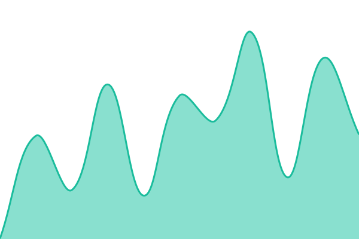 273ms
     
 | 

<a href="https://MatiasM87.github.io/uptime/history/exceso-de-desmontes">100.00%</a>
    

|  [Protege las Ballenas](https://protegelasballenas.org/) | 🟩 Up | [protege-las-ballenas.yml](https://github.com/MatiasM87/uptime/commits/HEAD/history/protege-las-ballenas.yml) | 

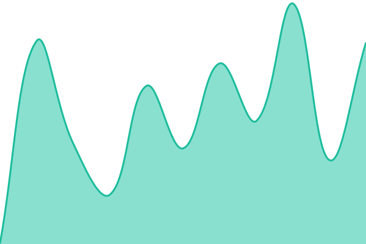 236ms
     
 | 

<a href="https://MatiasM87.github.io/uptime/history/protege-las-ballenas">100.00%</a>
    

|  [Respeta la Amazonia](https://respetalaamazonia.org/) | 🟩 Up | [respeta-la-amazonia.yml](https://github.com/MatiasM87/uptime/commits/HEAD/history/respeta-la-amazonia.yml) | 

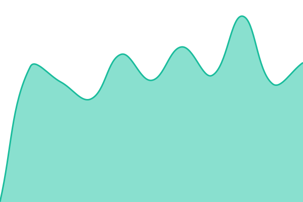 551ms
     
 | 

<a href="https://MatiasM87.github.io/uptime/history/respeta-la-amazonia">100.00%</a>
    

|  [Salvemos los Glaciares](https://salvemoslosglaciares.org/) | 🟩 Up | [salvemos-los-glaciares.yml](https://github.com/MatiasM87/uptime/commits/HEAD/history/salvemos-los-glaciares.yml) | 

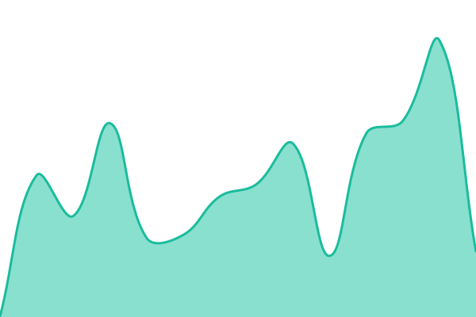 294ms
     
 | 

<a href="https://MatiasM87.github.io/uptime/history/salvemos-los-glaciares">100.00%</a>
    

|  [Test Middleware Consultas](https://test-middleware-consultas.infogreenpeace.org/) | 🟩 Up | [test-middleware-consultas.yml](https://github.com/MatiasM87/uptime/commits/HEAD/history/test-middleware-consultas.yml) | 

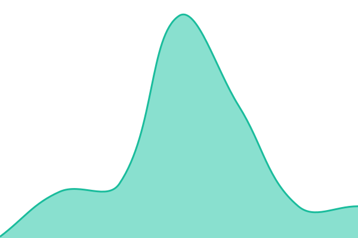 94ms
     
 | 

<a href="https://MatiasM87.github.io/uptime/history/test-middleware-consultas">100.00%</a>
    

|  [UniFi Controller](https://unificontroller.voluntariosgreenpeace.cl/) | 🟩 Up | [uni-fi-controller.yml](https://github.com/MatiasM87/uptime/commits/HEAD/history/uni-fi-controller.yml) | 

 319ms
     
 | 

<a href="https://MatiasM87.github.io/uptime/history/uni-fi-controller">100.00%</a>
    

|  [Upgrade Greenpeace AR](https://upgrade.greenpeace.ar/) | 🟩 Up | [upgrade-greenpeace-ar.yml](https://github.com/MatiasM87/uptime/commits/HEAD/history/upgrade-greenpeace-ar.yml) | 

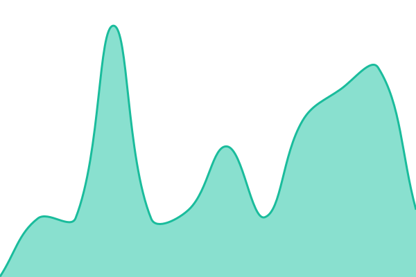 233ms
     
 | 

<a href="https://MatiasM87.github.io/uptime/history/upgrade-greenpeace-ar">100.00%</a>
    

|  [Upgrade Greenpeace CL](https://upgrade.greenpeace.cl/) | 🟩 Up | [upgrade-greenpeace-cl.yml](https://github.com/MatiasM87/uptime/commits/HEAD/history/upgrade-greenpeace-cl.yml) | 

 153ms
     
 | 

<a href="https://MatiasM87.github.io/uptime/history/upgrade-greenpeace-cl">100.00%</a>
    

|  [Dev App Greenpeace CL](https://www-dev.app.greenpeace.cl/) | 🟩 Up | [dev-app-greenpeace-cl.yml](https://github.com/MatiasM87/uptime/commits/HEAD/history/dev-app-greenpeace-cl.yml) | 

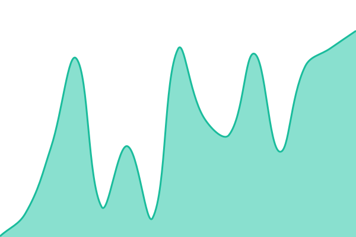 128ms
     
 | 

<a href="https://MatiasM87.github.io/uptime/history/dev-app-greenpeace-cl">100.00%</a>
    

|  [Dev App Greenpeace CO](https://www-dev.app.greenpeace.co/) | 🟩 Up | [dev-app-greenpeace-co.yml](https://github.com/MatiasM87/uptime/commits/HEAD/history/dev-app-greenpeace-co.yml) | 

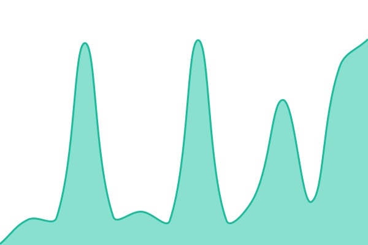 75ms
     
 | 

<a href="https://MatiasM87.github.io/uptime/history/dev-app-greenpeace-co">100.00%</a>
    

|  [Dev App Greenpeace AR](https://www-dev.app.greenpeace.org.ar/) | 🟩 Up | [dev-app-greenpeace-ar.yml](https://github.com/MatiasM87/uptime/commits/HEAD/history/dev-app-greenpeace-ar.yml) | 

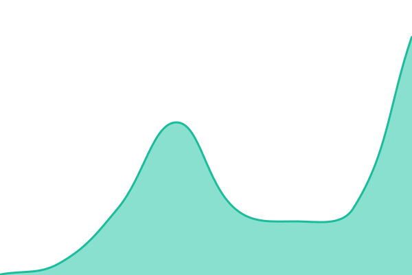 193ms
     
 | 

<a href="https://MatiasM87.github.io/uptime/history/dev-app-greenpeace-ar">100.00%</a>
    

<!--end: status pages-->

[**Visit our status website →**](https://demo.upptime.js.org)

## 📄 License

- Powered by: [Upptime](https://github.com/upptime/upptime)
- Code: [MIT](./LICENSE) © [MatiasM87](https://demo.upptime.js.org)
- Data in the `./history` directory: [Open Database License](https://opendatacommons.org/licenses/odbl/1-0/)
