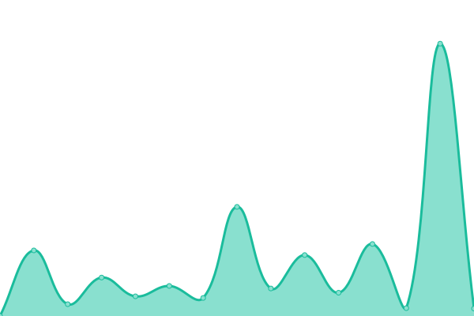

# [📈 Live Status](https://demo.upptime.js.org): <!--live status--> **🟧 Partial outage**

This repository contains the open-source uptime monitor and status page for [MatiasM87](https://demo.upptime.js.org), powered by [Upptime](https://github.com/upptime/upptime).

With [Upptime](https://upptime.js.org), you can get your own unlimited and free uptime monitor and status page, powered entirely by a GitHub repository. We use [Issues](https://github.com/MatiasM87/MatiasM87/issues) as incident reports, [Actions](https://github.com/MatiasM87/MatiasM87/actions) as uptime monitors, and [Pages](https://demo.upptime.js.org) for the status page.

<!--start: status pages-->
<!-- This summary is generated by Upptime (https://github.com/upptime/upptime) -->
<!-- Do not edit this manually, your changes will be overwritten -->
<!-- prettier-ignore -->
| URL | Status | History | Response Time | Uptime |
| --- | ------ | ------- | ------------- | ------ |
|  [Greenpeace App](https://app.greenpeace.org.ar/coupon/regular/forms/registration) | 🟩 Up | [greenpeace-app.yml](https://github.com/MatiasM87/uptime/commits/HEAD/history/greenpeace-app.yml) | 

 224ms
     
 | 

<a href="https://MatiasM87.github.io/uptime/history/greenpeace-app">100.00%</a>
    

|  [Ticketing App](https://rt.greenpeace.org.ar/) | 🟥 Down | [ticketing-app.yml](https://github.com/MatiasM87/uptime/commits/HEAD/history/ticketing-app.yml) | 

 2540ms
     
 | 

<a href="https://MatiasM87.github.io/uptime/history/ticketing-app">40.63%</a>
    

|  [Inventario App](https://inventario.voluntariosgreenpeace.cl/) | 🟥 Down | [inventario-app.yml](https://github.com/MatiasM87/uptime/commits/HEAD/history/inventario-app.yml) | 

 1072ms
     
 | 

<a href="https://MatiasM87.github.io/uptime/history/inventario-app">29.44%</a>
    

|  [BackOffice App [AR]](https://backoffice.greenpeace.org.ar/) | 🟩 Up | [back-office-app-ar.yml](https://github.com/MatiasM87/uptime/commits/HEAD/history/back-office-app-ar.yml) | 

 590ms
     
 | 

<a href="https://MatiasM87.github.io/uptime/history/back-office-app-ar">100.00%</a>
    

|  [BackOffice App [CL]](https://backoffice.voluntariosgreenpeace.cl/) | 🟥 Down | [back-office-app-cl.yml](https://github.com/MatiasM87/uptime/commits/HEAD/history/back-office-app-cl.yml) | 

 171ms
     
 | 

<a href="https://MatiasM87.github.io/uptime/history/back-office-app-cl">24.67%</a>
    

<!--end: status pages-->

[**Visit our status website →**](https://demo.upptime.js.org)

## 📄 License

- Powered by: [Upptime](https://github.com/upptime/upptime)
- Code: [MIT](./LICENSE) © [MatiasM87](https://demo.upptime.js.org)
- Data in the `./history` directory: [Open Database License](https://opendatacommons.org/licenses/odbl/1-0/)
